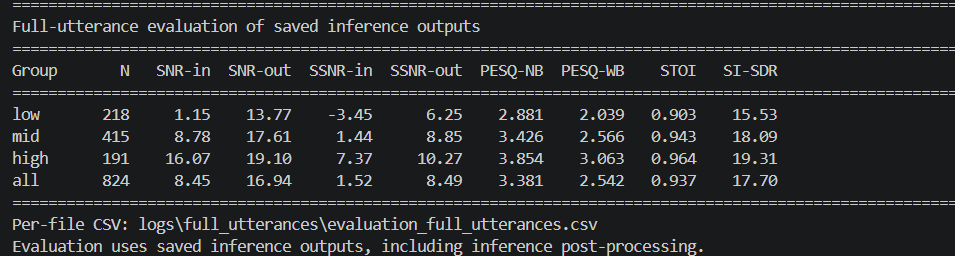
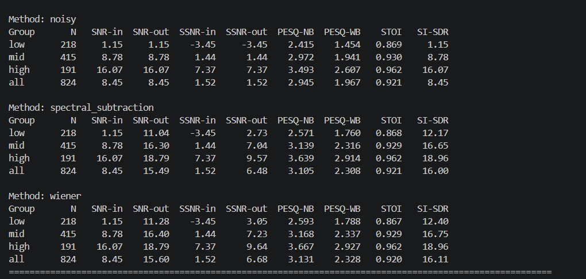

# Wave-U-Net + BiLSTM + 自注意力语音去噪

本项目实现一个端到端时域语音增强系统。模型以 16 kHz 单声道带噪波形为输入，使用 Wave-U-Net 提取多尺度特征，在瓶颈层加入双向 LSTM 和多头自注意力，最终直接输出完整去噪波形。

项目在 Edinburgh Noisy Speech Database（VoiceBank-DEMAND）上训练，并提供两类完整语音评估：

- 官方 VoiceBank-DEMAND 824 条测试语音，用于标准测试和传统算法对比。
- 自建全量 VCTK+DEMAND 31,408 条测试语音，用于未见说话人和更强噪声条件下的跨数据集泛化测试。

仓库包含源码、最佳模型、逐文件评估 CSV、汇总日志和结果图；不包含原始数据集、预处理缓存及批量去噪 WAV。

## 1. 主要特点

- 直接处理原始波形，不依赖频谱掩码重建。
- 五层一维 Wave-U-Net 编码器和解码器。
- 两层 BiLSTM 建模双向长时依赖。
- 八头自注意力建模全局语音关系。
- SI-SDR 与多分辨率 STFT 联合损失。
- 支持任意长度完整语音的窗口化、重叠相加推理。
- 默认启用 80–7500 Hz 带通滤波和峰值响度匹配后处理。
- 支持 SNR、SSNR、PESQ-NB、PESQ-WB、STOI 和 SI-SDR 评估。
- 提供原始带噪、谱减法和维纳滤波基线。

## 2. 模型结构

```text
带噪波形 (B, 1, T)
        │
        ▼
五层 Wave-U-Net 编码器
1 → 32 → 64 → 128 → 256 → 512
每层：Conv1d(stride=2) + BN + PReLU + Conv1d + BN + PReLU
        │
        ▼
两层双向 LSTM
每个方向隐藏维度 256，输出通道 512
        │
        ▼
八头多头自注意力 + 前馈网络 + 残差连接
        │
        ▼
五层 Wave-U-Net 解码器
线性插值上采样 + 编码器跳跃连接 + 一维卷积
        │
        ▼
预测残差波形
        │
        ▼
去噪波形 = 带噪输入 + 预测残差
```

模型参数量为 **17,914,257（约 17.9 M）**。跳跃连接保留局部波形细节，BiLSTM 提供双向时序上下文，自注意力补充全局依赖。

### 2.1 损失函数

```text
L = -SI-SDR + 0.1 × Multi-Resolution STFT Loss
```

多分辨率 STFT 配置为：

```text
(n_fft=256,  hop=64,  win=256)
(n_fft=512,  hop=128, win=512)
(n_fft=1024, hop=256, win=1024)
```

SI-SDR 约束时域信号保真度，多分辨率 STFT 损失同时约束不同时间和频率尺度上的频谱结构。

### 2.2 完整语音推理与后处理

完整语音不会作为一个超长张量一次送入显存。程序在内部使用 2 秒窗口和 50% 重叠进行推理，再通过加权重叠相加重建完整波形。窗口只用于控制显存，不用于分段统计测试指标。

默认后处理包括：

1. 二阶 80 Hz 高通滤波；
2. 二阶 7500 Hz 低通滤波；
3. 按输入语音峰值进行输出响度匹配。

正式结果和传统基线均使用后处理后的完整语音。

## 3. 数据集

### 3.1 VoiceBank-DEMAND（训练与标准测试）

目录结构：

```text
data/edinburgh/
├── clean_trainset_28spk_wav/
├── noisy_trainset_28spk_wav/
├── clean_testset_wav/
└── noisy_testset_wav/
```

训练部分按说话人划分，防止相同说话人同时进入训练集和验证集：

| 划分 | 原始完整语音 | 2 秒训练缓存 |
|---|---:|---:|
| 训练集 | 9,075 | 24,720 |
| 验证集 | 2,497 | 7,648 |
| 官方测试集 | 824 | 不生成片段缓存 |

测试指标始终在 824 条完整语音上计算。

### 3.2 自建全量 VCTK+DEMAND 测试集

跨数据集测试采用 VCTK 0.92 的 `mic1` 纯净录音，排除已在 Edinburgh 训练集和测试集中出现的说话人，再与 DEMAND 噪声混合。目标 SNR 循环采用 `-5、0、5、10、15 dB`，随机种子为 42。

该测试集共 31,408 对完整语音。

## 4. 实验结果

### 4.1 VoiceBank-DEMAND 官方 824 条完整语音

| 方法 | SNR-out/dB ↑ | SSNR-out/dB ↑ | PESQ-NB ↑ | PESQ-WB ↑ | STOI ↑ | SI-SDR/dB ↑ |
|---|---:|---:|---:|---:|---:|---:|
| 原始带噪语音 | 8.45 | 1.52 | 2.945 | 1.967 | 0.921 | 8.45 |
| 谱减法 | 15.49 | 6.48 | 3.105 | 2.308 | 0.921 | 16.00 |
| 维纳滤波 | 15.60 | 6.68 | 3.131 | 2.328 | 0.920 | 16.11 |
| **Wave-U-Net + BiLSTM + Attention** | **16.94** | **8.49** | **3.381** | **2.542** | **0.937** | **17.70** |

相对原始带噪语音，本模型带来：SNR `+8.49 dB`、SSNR `+6.97 dB`、PESQ-WB `+0.575`、STOI `+0.016`、SI-SDR `+9.25 dB`。





详细结果：

- `logs/full_utterances/evaluation_full_utterances.log`
- `logs/full_utterances/evaluation_full_utterances.csv`
- `logs/full_utterances/baselines_with_postprocess.log`
- `logs/full_utterances/baselines_with_postprocess.csv`

### 4.2 全量 VCTK+DEMAND 31,408 条完整语音

| SNR组 | 数量 | SNR-in | SNR-out | SSNR-in | SSNR-out | PESQ-NB | PESQ-WB | STOI | SI-SDR |
|---|---:|---:|---:|---:|---:|---:|---:|---:|---:|
| low | 15,819 | -0.96 | 10.69 | -5.03 | 3.87 | 2.656 | 1.809 | 0.738 | 12.55 |
| mid | 12,865 | 10.21 | 16.23 | 1.41 | 7.21 | 3.428 | 2.518 | 0.802 | 16.46 |
| high | 2,724 | 15.00 | 17.72 | 4.97 | 8.24 | 3.698 | 2.834 | 0.832 | 17.81 |
| **全部** | **31,408** | **5.00** | **13.57** | **-1.53** | **5.62** | **3.062** | **2.189** | **0.772** | **14.61** |

全量测试中，SNR 提升 8.57 dB、SSNR 提升 7.15 dB。结果低于官方 824 条测试，主要因为该集合包含 -5 dB 强噪声、更多未见说话人和不同的噪声组合，体现了明显的跨数据集分布差异。

详细结果位于 `logs/vctk_demand_all/`。

### 4.3 VCTK+DEMAND 824 条抽样测试

| 数量 | SNR-in | SNR-out | SSNR-in | SSNR-out | PESQ-NB | PESQ-WB | STOI | SI-SDR |
|---:|---:|---:|---:|---:|---:|---:|---:|---:|
| 824 | 4.99 | 13.46 | -1.51 | 5.56 | 3.056 | 2.188 | 0.773 | 14.52 |

详细结果位于 `logs/vctk_demand/`。

### 4.4 结果解释与限制

- 模型在官方测试集上全面超过带噪输入、谱减法和维纳滤波基线。
- 在 VCTK+DEMAND 上仍显著提升 SNR 和 SSNR，说明模型具备跨说话人泛化能力。
- PESQ、STOI 等指标会受到采样率、静音处理、后处理及具体指标实现影响。
- 当前训练目标主要优化 SI-SDR 和频谱重建，没有直接优化 PESQ，因此感知质量仍有提升空间。

## 5. 环境安装

推荐使用 Python 3.10 和独立 Conda 环境。PyTorch 需要根据本机 CUDA 版本单独安装。

### Windows PowerShell

```powershell
conda activate mamba
cd "D:\人工智能算法综合课程设计\audio-denoising-main"

# 示例：CUDA 12.4
python -m pip install torch torchaudio --index-url https://download.pytorch.org/whl/cu124
python -m pip install -r requirements.txt

python -c "import torch; print('PyTorch:', torch.__version__); print('CUDA:', torch.cuda.is_available()); print('GPU:', torch.cuda.get_device_name(0) if torch.cuda.is_available() else 'CPU')"
```

如果 PowerShell 中的 `python` 没有指向正确环境：

```powershell
$mambaPy = "D:\miniconda3\envs\mamba\python.exe"
& $mambaPy -m pip install -r requirements.txt
```

## 6. 训练流程

### 6.1 预处理

```powershell
$mambaPy = "D:\miniconda3\envs\mamba\python.exe"
& $mambaPy -u .\src\preprocess.py --dataset edinburgh
```

缓存保存到 `data/processed_wave/segments/train/` 和 `data/processed_wave/segments/val/`，不会生成测试集的 2 秒缓存。

### 6.2 训练参数

主要参数位于 `src/config.py`：

```python
BATCH_SIZE = 8          # 根据显存调整
MAX_EPOCHS = 100
LEARNING_RATE = 1e-3
WEIGHT_DECAY = 1e-4
MAX_TRAIN_FILES = None
MAX_VAL_FILES = None
EARLY_STOP_PATIENCE = 15
```

本仓库提供的最佳模型实际在 RTX 4090D 上以 `batch_size=64`、不开启 AMP 完成训练。最佳权重来自第 95 轮，验证集 SI-SDR 为 **14.38 dB**。

### 6.3 开始训练

```powershell
& $mambaPy -u .\src\train.py
```

最佳权重自动保存为 `checkpoints/best_wave_model.pt`。训练以验证集 SI-SDR 选择最佳权重，连续 15 轮无提升时早停。

## 7. 官方824条完整语音测试

### 7.1 推理

```powershell
$mambaPy = "D:\miniconda3\envs\mamba\python.exe"
& $mambaPy -u .\src\inference.py `
  --batch 824 `
  --checkpoint .\checkpoints\best_wave_model.pt `
  --output-dir .\outputs\full_utterances
```

### 7.2 评估

```powershell
& $mambaPy -u .\src\evaluate_full_utterances.py `
  --outputs-dir .\outputs\full_utterances `
  --noisy-dir .\data\edinburgh\noisy_testset_wav `
  --clean-dir .\data\edinburgh\clean_testset_wav `
  --report .\logs\full_utterances\evaluation_full_utterances.log
```

## 8. 全量VCTK+DEMAND测试

以下命令假设 VCTK 已解压到 `data/vctk/extracted/`，DEMAND 已解压到 `data/demand/`。

### 8.1 生成31,408条配对语音

```powershell
& $mambaPy -u .\src\prepare_vctk_demand_test.py `
  --vctk-root .\data\vctk\extracted `
  --demand-root .\data\demand `
  --output-root .\data\vctk_demand_test `
  --count 31408 `
  --seed 42
```

### 8.2 推理

关闭逐文件频谱图和输入副本可显著减少磁盘占用。`--resume` 会跳过已经完成的文件。

```powershell
& $mambaPy -u .\src\inference.py `
  --input-dir .\data\vctk_demand_test\noisy `
  --batch 0 `
  --output-dir .\outputs\vctk_demand_all `
  --checkpoint .\checkpoints\best_wave_model.pt `
  --no-plots `
  --no-save-noisy `
  --resume
```

### 8.3 评估

```powershell
& $mambaPy -u .\src\evaluate_full_utterances.py `
  --outputs-dir .\outputs\vctk_demand_all `
  --noisy-dir .\data\vctk_demand_test\noisy `
  --clean-dir .\data\vctk_demand_test\clean `
  --report .\logs\vctk_demand_all\evaluation.log
```

## 9. 传统基线

```powershell
& $mambaPy -u .\src\baseline.py `
  --report .\logs\full_utterances\baselines_with_postprocess.log
```

谱减法和维纳滤波会使用与神经网络相同的推理后处理，保证系统级比较方式一致。

## 10. 单条语音去噪

```powershell
& $mambaPy -u .\src\inference.py `
  --input .\example_noisy.wav `
  --output .\outputs\example_denoised.wav `
  --checkpoint .\checkpoints\best_wave_model.pt
```

没有纯净参考语音时，可以保存、试听和观察频谱，但不能可靠计算 PESQ、STOI、SNR、SSNR 或 SI-SDR。

## 11. 主要文件

| 文件 | 作用 |
|---|---|
| `src/wave_model.py` | Wave-U-Net、BiLSTM 和自注意力模型 |
| `src/losses.py` | SI-SDR 与多分辨率 STFT 联合损失 |
| `src/preprocess.py` | Edinburgh训练/验证数据预处理 |
| `src/dataset.py` | 原始数据加载与动态混合工具 |
| `src/train.py` | 训练、验证、学习率调度、早停与权重保存 |
| `src/inference.py` | 单条及批量完整语音推理与后处理 |
| `src/evaluate.py` | 指标实现和窗口化重叠相加推理 |
| `src/evaluate_full_utterances.py` | 已保存完整语音结果的统一评估 |
| `src/baseline.py` | 带噪、谱减和维纳滤波基线 |
| `src/prepare_vctk_demand_test.py` | 生成自建VCTK+DEMAND配对测试集 |
| `src/config.py` | 路径、模型和训练超参数 |

## 12. 模型文件

```text
checkpoints/best_wave_model.pt
大小：71,753,350 bytes（约 68.4 MiB）
SHA-256：603D331BB431A71FB1D6E37A224B0590B14B609BDC135105DBF841F03B37CDC1
```

## 13. 仓库不包含的内容

- `data/`：Edinburgh、VCTK、DEMAND及预处理缓存；
- `outputs/`：批量推理生成的 WAV 和逐语音频谱图；
- `.venv/`、`venv/`、`env/`：虚拟环境；

克隆仓库后需要自行准备数据集，但可以直接使用仓库中的最佳模型权重。