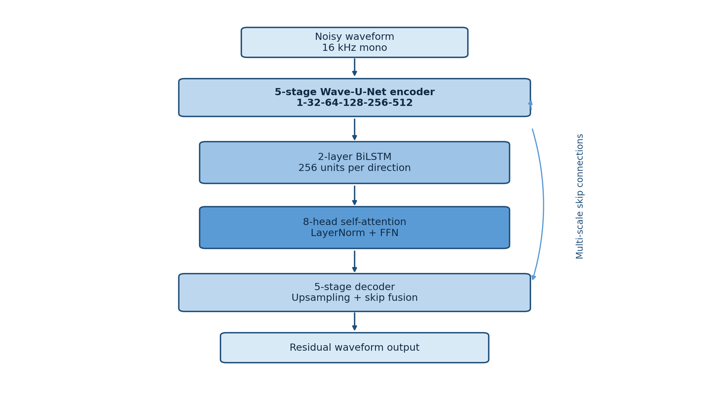
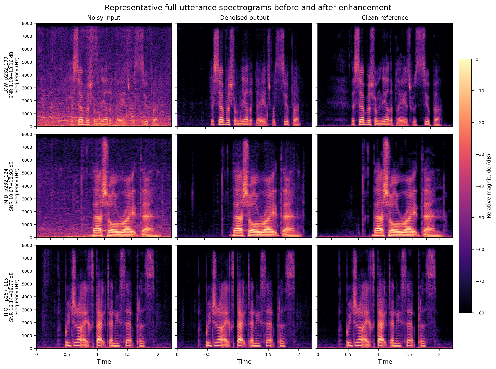
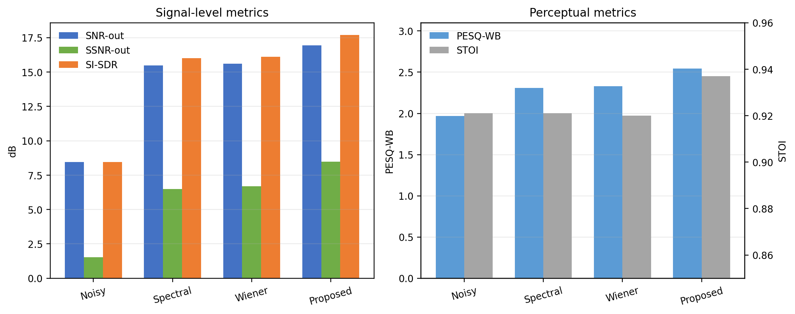

# 基于 Wave-U-Net、LSTM 与自注意力的端到端语音去噪

本项目实现一个直接处理原始波形的语音增强系统。输入为 16 kHz 单声道带噪语音，主体网络采用一维 Wave-U-Net，并可在瓶颈位置组合双向 LSTM、单向 LSTM和多头自注意力。项目支持完整语音推理、统一后处理、传统算法基线、跨数据集测试和可复现的模型消融实验。

训练数据使用 Edinburgh Noisy Speech Database（VoiceBank-DEMAND），正式测试包括：

- VoiceBank-DEMAND 官方 824 条完整测试语音；
- 自建 VCTK+DEMAND 31,408 条完整测试语音。

仓库包含源码、完整模型权重、逐文件评估结果、汇总日志和结果图，不包含原始数据集、预处理缓存以及批量去噪 WAV。

## 1. 当前实验状态

计划比较 1 个完整模型和 3 个消融模型：

| 模型 | LSTM | 自注意力 | 参数量 | 状态 |
|---|---|---:|---:|---|
| Wave-U-Net + BiLSTM + Attention | 双向，两层 | 8 头 | 17,914,257 | 已完成 |
| Wave-U-Net + UniLSTM + Attention | 单向，两层 | 8 头 | 16,206,737 | 已完成 |
| Wave-U-Net + Attention | 无 | 8 头 | 14,760,337 | 代码已完成，待训练/评估 |
| 纯 Wave-U-Net | 无 | 无 | 12,657,553 | 代码已完成，待训练/评估 |


## 2. 主要功能

- 直接从带噪波形预测去噪波形，不依赖频谱掩码重建；
- 五层一维 Wave-U-Net 编码器、解码器和跳跃连接；
- 可切换 BiLSTM、UniLSTM、纯注意力或无瓶颈模块；
- SI-SDR 与多分辨率 STFT 联合损失；
- 支持任意长度完整语音的窗口化、重叠相加推理；
- 默认启用 80–7500 Hz 带通滤波和峰值响度匹配后处理；
- 计算 SNR、SSNR、PESQ-NB、PESQ-WB、STOI 和 SI-SDR；
- 提供原始带噪、谱减法和维纳滤波基线；
- 检查点保存模型结构配置，推理时自动还原对应消融结构。

## 3. 模型结构

完整模型的数据流如下：

```text
带噪波形 (B, 1, T)
        │
        ▼
Wave-U-Net 编码器
1 → 32 → 64 → 128 → 256 → 512
每层：Conv1d(stride=2) + BN + PReLU + Conv1d + BN + PReLU
        │
        ▼
两层 BiLSTM
每个方向隐藏维度 256，合并后保持 512 个瓶颈通道
        │
        ▼
8 头自注意力 + 前馈网络 + 归一化与残差连接
        │
        ▼
Wave-U-Net 解码器
线性插值上采样 + 编码器跳跃连接 + 一维卷积
        │
        ▼
预测残差波形
        │
        ▼
去噪波形 = 带噪输入 + 预测残差
```



### 3.1 联合损失

```text
L = -SI-SDR + 0.1 × Multi-Resolution STFT Loss
```

多分辨率 STFT 参数：

```text
(n_fft=256,  hop=64,  win=256)
(n_fft=512,  hop=128, win=512)
(n_fft=1024, hop=256, win=1024)
```

SI-SDR 约束时域重建质量，多分辨率 STFT 损失约束不同时间和频率尺度上的频谱结构。

### 3.2 完整语音推理

默认后处理包括：

1. 二阶 80 Hz 高通滤波；
2. 二阶 7500 Hz 低通滤波；
3. 按输入语音峰值进行输出响度匹配。

正式神经网络结果与传统基线结果均采用该后处理。



## 4. 数据集

### 4.1 VoiceBank-DEMAND

将数据解压为：

```text
data/edinburgh/
├── clean_trainset_28spk_wav/
├── noisy_trainset_28spk_wav/
├── clean_testset_wav/
└── noisy_testset_wav/
```

训练录音按照说话人划分，避免相同说话人同时进入训练集和验证集：

| 划分 | 完整语音数 | 2 秒缓存数 |
|---|---:|---:|
| 训练集 | 9,075 | 24,720 |
| 验证集 | 2,497 | 7,648 |
| 官方测试集 | 824 | 不生成测试片段缓存 |

官方 824 条测试语音始终直接从原始 WAV 读取，并以完整语音为单位计算指标。

### 4.2 VCTK+DEMAND 跨数据集测试

跨数据集测试采用 VCTK 0.92 的 `mic1` 纯净录音，排除 Edinburgh 中已经出现的说话人，再与 DEMAND 环境噪声混合。目标 SNR 循环采用 `-5、0、5、10、15 dB`，随机种子为 42，共生成 31,408 对完整语音。

此数据集用于观察未见说话人、强噪声和分布变化条件下的泛化性能。

## 5. 环境安装

推荐 Python 3.10。PyTorch 不写入 `requirements.txt`，应根据 GPU 和 CUDA 单独安装。

### 5.1 Windows + Conda/Mamba

```powershell
conda activate mamba
cd "D:\人工智能算法综合课程设计\audio-denoising-main"

# 根据本机 CUDA 选择适合的 PyTorch 版本；以下仅为 CUDA 12.4 示例
python -m pip install torch torchaudio --index-url https://download.pytorch.org/whl/cu124
python -m pip install -r requirements.txt

python -c "import torch; print('PyTorch:', torch.__version__); print('CUDA:', torch.cuda.is_available()); print('GPU:', torch.cuda.get_device_name(0) if torch.cuda.is_available() else 'CPU')"
```

如果 PowerShell 中的 `python` 没有指向目标环境：

```powershell
$mambaPy = "D:\miniconda3\envs\mamba\python.exe"
& $mambaPy -m pip install -r requirements.txt
```

### 5.2 RTX 5090 服务器

RTX 5090 需要支持 `sm_120` 的 PyTorch。当前实验验证可用的环境为：

```bash
pip install torch==2.7.1+cu128 torchaudio==2.7.1+cu128 \
  --index-url https://download.pytorch.org/whl/cu128
pip install -r requirements.txt

python -c "import torch; print(torch.__version__); print(torch.cuda.get_device_name(0)); print(torch.cuda.get_arch_list())"
```

输出的支持架构中应包含 `sm_120`。

## 6. 快速开始

### 6.1 预处理训练和验证数据

Windows PowerShell：

```powershell
$mambaPy = "D:\miniconda3\envs\mamba\python.exe"
& $mambaPy -u .\src\preprocess.py --dataset edinburgh
```

Linux：

```bash
python -u src/preprocess.py --dataset edinburgh
```

输出目录：

```text
data/processed_wave/segments/train/
data/processed_wave/segments/val/
```

重新预处理前应确认目标目录，避免旧缓存和新缓存混合。

### 6.2 训练完整模型

本机默认参数来自 `src/config.py`：

```powershell
& $mambaPy -u .\src\train.py `
  --lstm-direction bidirectional `
  --checkpoint-name best_wave_model.pt
```

RTX 5090 服务器上的可复现实验命令：

```bash
python -u src/train.py \
  --lstm-direction bidirectional \
  --checkpoint-name best_wave_bilstm_attention_b128.pt \
  --batch-size 128 \
  --num-workers 8
```

### 6.3 后台训练

```bash
mkdir -p logs
nohup python -u src/train.py \
  --lstm-direction bidirectional \
  --checkpoint-name best_wave_bilstm_attention_b128.pt \
  --batch-size 128 \
  --num-workers 8 \
  > logs/train_bilstm_attention_b128.log 2>&1 &

echo $!
tail -f logs/train_bilstm_attention_b128.log
```

在 `tail -f` 界面按 `Ctrl+C` 只会退出日志查看，不会终止后台训练。

## 7. 消融实验

### 7.1 UniLSTM + Attention

```bash
python -u src/train.py \
  --lstm-direction unidirectional \
  --checkpoint-name best_wave_unilstm_attention_b128.pt \
  --batch-size 128 \
  --num-workers 8
```

### 7.2 Attention only（无 LSTM）

```bash
python -u src/train.py \
  --lstm-direction none \
  --checkpoint-name best_wave_attention_only_b128.pt \
  --batch-size 128 \
  --num-workers 8
```

### 7.3 纯 Wave-U-Net（无 LSTM、无注意力）

```bash
python -u src/train.py \
  --lstm-direction none \
  --no-attention \
  --checkpoint-name best_wave_unet_only_b128.pt \
  --batch-size 128 \
  --num-workers 8
```

建议的输出命名：

```text
checkpoints/
├── best_wave_model.pt
├── best_wave_unilstm_attention_b128.pt
├── best_wave_attention_only_b128.pt
└── best_wave_unet_only_b128.pt

logs/
├── full_utterances/
├── ablation_unilstm_attention_b128/
├── ablation_attention_only_b128/
└── ablation_wave_unet_only/
```

## 8. VoiceBank-DEMAND完整语音测试

以下流程直接处理 824 条原始测试 WAV，并默认启用后处理。

### 8.1 批量推理

Windows PowerShell：

```powershell
& $mambaPy -u .\src\inference.py `
  --input-dir .\data\edinburgh\noisy_testset_wav `
  --batch 0 `
  --output-dir .\outputs\full_utterances `
  --checkpoint .\checkpoints\best_wave_model.pt `
  --postprocess `
  --no-plots `
  --no-save-noisy `
  --resume
```

Linux：

```bash
python -u src/inference.py \
  --input-dir data/edinburgh/noisy_testset_wav \
  --batch 0 \
  --output-dir outputs/full_utterances \
  --checkpoint checkpoints/best_wave_model.pt \
  --postprocess \
  --no-plots \
  --no-save-noisy \
  --resume
```

`--batch 0` 表示处理输入目录中的全部文件；这里的 `batch` 是文件数量上限，不是训练时的 GPU batch size。`--resume` 会跳过已经存在的去噪 WAV。

### 8.2 计算六项指标

```powershell
& $mambaPy -u .\src\evaluate_full_utterances.py `
  --outputs-dir .\outputs\full_utterances `
  --noisy-dir .\data\edinburgh\noisy_testset_wav `
  --clean-dir .\data\edinburgh\clean_testset_wav `
  --report .\logs\full_utterances\evaluation_full_utterances.log
```

评估同时生成同名 CSV，例如：

```text
logs/full_utterances/evaluation_full_utterances.log
logs/full_utterances/evaluation_full_utterances.csv
```

## 9. 已完成实验结果

### 9.1 824条完整语音

| 方法 | SNR-out/dB ↑ | SSNR-out/dB ↑ | PESQ-NB ↑ | PESQ-WB ↑ | STOI ↑ | SI-SDR/dB ↑ |
|---|---:|---:|---:|---:|---:|---:|
| 原始带噪语音 | 8.45 | 1.52 | 2.945 | 1.967 | 0.921 | 8.45 |
| 谱减法 | 15.49 | 6.48 | 3.105 | 2.308 | 0.921 | 16.00 |
| 维纳滤波 | 15.60 | 6.68 | 3.131 | 2.328 | 0.920 | 16.11 |
| **Wave-U-Net + BiLSTM + Attention** | **16.94** | **8.49** | **3.381** | **2.542** | **0.937** | **17.70** |
| Wave-U-Net + UniLSTM + Attention | 16.88 | 8.42 | 3.360 | 2.496 | 0.935 | 17.63 |
| Wave-U-Net + Attention | 待完成 | 待完成 | 待完成 | 待完成 | 待完成 | 待完成 |
| 纯 Wave-U-Net | 待完成 | 待完成 | 待完成 | 待完成 | 待完成 | 待完成 |

完整模型相对原始带噪语音提升：SNR `+8.49 dB`、SSNR `+6.97 dB`、PESQ-WB `+0.575`、STOI `+0.016`、SI-SDR `+9.25 dB`。

UniLSTM 模型使用约少 9.5% 的参数，完整测试 SI-SDR 仅下降 0.07 dB



结果文件：

- `logs/full_utterances/evaluation_full_utterances.log`
- `logs/full_utterances/evaluation_full_utterances.csv`
- `logs/full_utterances/baselines_with_postprocess.log`
- `logs/full_utterances/baselines_with_postprocess.csv`
- `logs/ablation_unilstm_attention_b128/evaluation.log`
- `logs/ablation_unilstm_attention_b128/evaluation.csv`

### 9.2 VCTK+DEMAND 31,408条完整语音

| SNR组 | 数量 | SNR-in | SNR-out | SSNR-in | SSNR-out | PESQ-NB | PESQ-WB | STOI | SI-SDR |
|---|---:|---:|---:|---:|---:|---:|---:|---:|---:|
| low | 15,819 | -0.96 | 10.69 | -5.03 | 3.87 | 2.656 | 1.809 | 0.738 | 12.55 |
| mid | 12,865 | 10.21 | 16.23 | 1.41 | 7.21 | 3.428 | 2.518 | 0.802 | 16.46 |
| high | 2,724 | 15.00 | 17.72 | 4.97 | 8.24 | 3.698 | 2.834 | 0.832 | 17.81 |
| **全部** | **31,408** | **5.00** | **13.57** | **-1.53** | **5.62** | **3.062** | **2.189** | **0.772** | **14.61** |

全量跨数据集测试中，SNR 提升 8.57 dB，SSNR 提升 7.15 dB。结果低于824测试集，主要原因是包含 -5 dB 强噪声、更多未见说话人及不同噪声组合。

详细结果位于 `logs/vctk_demand_all/`。

## 10. 传统算法基线

```powershell
& $mambaPy -u .\src\baseline.py `
  --report .\logs\full_utterances\baselines_with_postprocess.log
```

谱减法和维纳滤波使用与神经网络相同的后处理，保证系统级比较方式一致。

## 11. VCTK+DEMAND全量测试

假设 VCTK 已解压到 `data/vctk/extracted/`，DEMAND 已解压到 `data/demand/`。

### 11.1 生成测试集

```powershell
& $mambaPy -u .\src\prepare_vctk_demand_test.py `
  --vctk-root .\data\vctk\extracted `
  --demand-root .\data\demand `
  --output-root .\data\vctk_demand_test `
  --count 31408 `
  --seed 42
```

生成程序支持继续运行，已有的有效文件不会重复生成。

### 11.2 推理与评估

```powershell
& $mambaPy -u .\src\inference.py `
  --input-dir .\data\vctk_demand_test\noisy `
  --batch 0 `
  --output-dir .\outputs\vctk_demand_all `
  --checkpoint .\checkpoints\best_wave_model.pt `
  --postprocess `
  --no-plots `
  --no-save-noisy `
  --resume

& $mambaPy -u .\src\evaluate_full_utterances.py `
  --outputs-dir .\outputs\vctk_demand_all `
  --noisy-dir .\data\vctk_demand_test\noisy `
  --clean-dir .\data\vctk_demand_test\clean `
  --report .\logs\vctk_demand_all\evaluation.log
```

## 12. 单条语音去噪

```powershell
& $mambaPy -u .\src\inference.py `
  --input .\example_noisy.wav `
  --output .\outputs\example_denoised.wav `
  --checkpoint .\checkpoints\best_wave_model.pt
```

如果没有对应的纯净参考语音，可以试听和观察频谱，但不能可靠计算 SNR、SSNR、PESQ、STOI 或 SI-SDR。

## 13. 项目结构

```text
audio-denoising-main/
├── src/
│   ├── config.py
│   ├── wave_model.py
│   ├── preprocess.py
│   ├── train.py
│   ├── inference.py
│   ├── evaluate.py
│   ├── evaluate_full_utterances.py
│   ├── baseline.py
│   ├── losses.py
│   ├── dataset.py
│   ├── prepare_vctk_demand_test.py
│   └── utils.py
├── checkpoints/                 # 模型权重，不包含数据集
├── logs/                        # 汇总日志和逐文件指标
├── result/                      # 结果图和报告插图
├── download/                    # 数据集下载脚本
├── requirements.txt
└── README.md
```

主要文件：

| 文件 | 作用 |
|---|---|
| `src/wave_model.py` | Wave-U-Net、LSTM、注意力及消融结构 |
| `src/losses.py` | SI-SDR 与多分辨率 STFT 联合损失 |
| `src/preprocess.py` | Edinburgh 训练/验证数据预处理 |
| `src/train.py` | 训练、验证、学习率调度、早停与权重保存 |
| `src/inference.py` | 单条及批量完整语音推理与后处理 |
| `src/evaluate.py` | 指标实现和窗口化重叠相加推理 |
| `src/evaluate_full_utterances.py` | 完整语音统一评估 |
| `src/baseline.py` | 带噪、谱减法和维纳滤波基线 |
| `src/prepare_vctk_demand_test.py` | 生成 VCTK+DEMAND 配对测试集 |
| `src/config.py` | 路径、模型和训练超参数 |

## 14. 模型文件与兼容性

完整模型：

```text
checkpoints/best_wave_model.pt
大小：71,753,350 bytes（约 68.4 MiB）
SHA-256：603D331BB431A71FB1D6E37A224B0590B14B609BDC135105DBF841F03B37CDC1
```

UniLSTM 消融模型：

```text
checkpoints/best_wave_unilstm_attention_b128.pt
大小：约 61.9 MiB
SHA-256：2BB91BCBA76BD2E45910F1385130324E56437ACC7B7D59FEAEF0120B891F8643
```

新检查点中的 `model_config` 会保存 `use_lstm`、`lstm_bidirectional` 和 `use_attention`。`inference.py` 会读取这些字段并自动创建正确结构。旧检查点缺少新字段时默认使用注意力，因此原有 BiLSTM 和 UniLSTM 权重仍可加载。


## 15. 仓库不包含的内容

- `data/`：Edinburgh、VCTK、DEMAND 和预处理缓存；
- `outputs/`：批量推理生成的 WAV 和逐语音频谱图；
- `.venv/`、`venv/`、`env/`：虚拟环境；
- 临时下载文件、W&B 本地缓存和中间检查点。

克隆仓库后需要自行准备数据集。仓库中的完整模型权重可以直接用于推理和官方测试。

## 17. 参考资料

- Wave-U-Net: A Multi-Scale Neural Network for End-to-End Audio Source Separation, 2018.
- Edinburgh DataShare: Noisy Speech Database for Training Speech Enhancement Algorithms and TTS Models.
- CSTR VCTK Corpus, version 0.92.
- DEMAND: Diverse Environments Multichannel Acoustic Noise Database.
