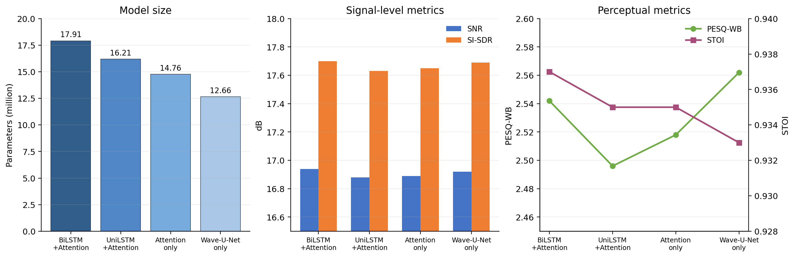
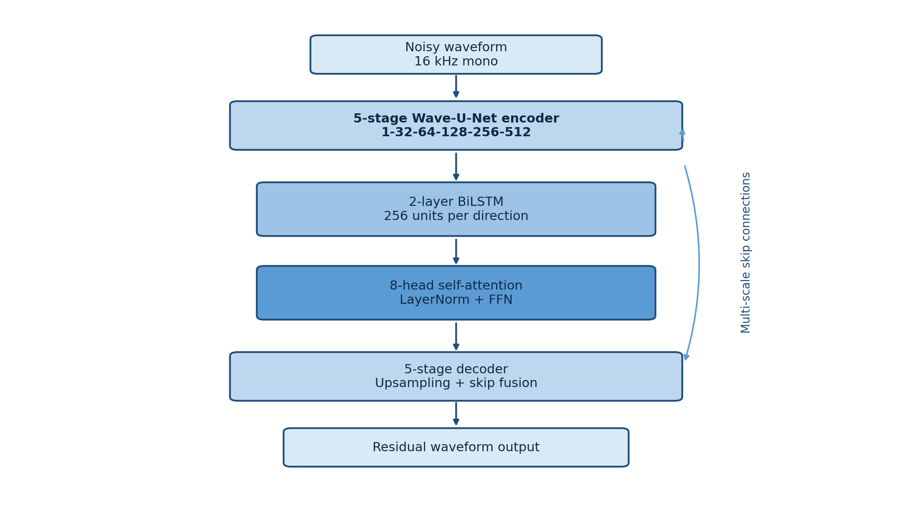
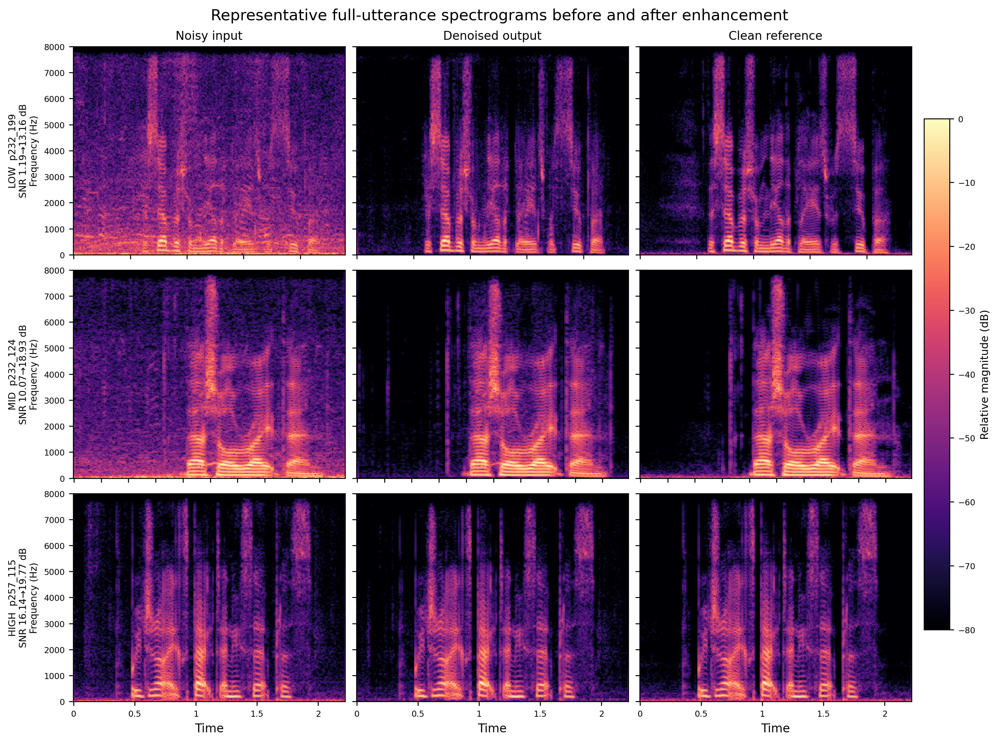
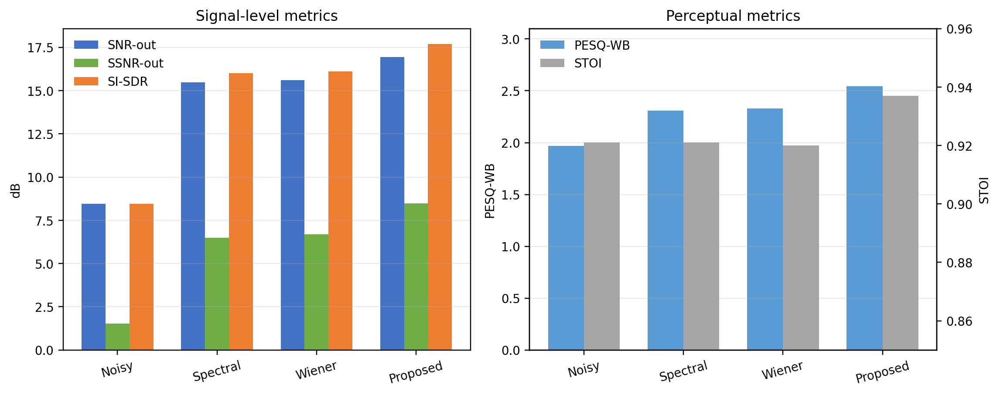

# Wave-U-Net 端到端语音去噪系统

本项目是人工智能算法综合课程设计，目标是从 16 kHz 单通道带噪语音中恢复清晰、可懂的目标语音。系统以一维 Wave-U-Net 为主体，在瓶颈处可选配 BiLSTM、UniLSTM 和多头自注意力，并提供训练、完整语音推理、统一后处理、六项客观指标、传统算法基线、跨数据集测试和消融实验的完整流程。

训练数据采用 Edinburgh Noisy Speech Database（VoiceBank-DEMAND）。正式实验包括：

- VoiceBank-DEMAND 官方 824 条完整测试语音；
- 自建 VCTK+DEMAND 31,408 条完整语音跨数据集测试；
- 带噪输入、谱减法和维纳滤波传统基线；
- BiLSTM、UniLSTM、仅注意力和纯 Wave-U-Net 四种结构对照。

正式实验报告见 [docs/WaveUNet语音去噪实验报告.docx](docs/WaveUNet语音去噪实验报告.docx)。仓库不包含原始数据集、预处理缓存和批量推理 WAV。

## 1. 实验结论

完整模型在官方 824 条完整语音上取得最佳综合结果；纯 Wave-U-Net 在减少约 29.3% 参数量的情况下，SI-SDR 仅下降 0.01 dB，表现出最好的参数效率。完整模型的优势主要集中在低输入 SNR 条件。

| 模型 | 参数量 | 最佳验证 SI-SDR/dB | SNR/dB | SSNR/dB | PESQ-NB | PESQ-WB | STOI | 测试 SI-SDR/dB |
|---|---:|---:|---:|---:|---:|---:|---:|---:|
| **Wave-U-Net + BiLSTM + Attention** | 17,914,257 | **14.38** | **16.94** | **8.49** | **3.381** | 2.542 | **0.937** | **17.70** |
| Wave-U-Net + UniLSTM + Attention | 16,206,737 | 14.23 | 16.88 | 8.42 | 3.360 | 2.496 | 0.935 | 17.63 |
| Wave-U-Net + Attention | 14,760,337 | 14.17 | 16.89 | 8.41 | 3.370 | 2.518 | 0.935 | 17.65 |
| **纯 Wave-U-Net** | **12,657,553** | 14.15 | 16.92 | 8.42 | 3.355 | **2.562** | 0.933 | 17.69 |

这些结果来自单次训练。完整模型使用 RTX 4090D、batch size 64；三个消融模型使用 RTX 5090、batch size 128。因此本表适合课程实验中的结构分析，但不能替代同一硬件、相同 batch size、多随机种子的严格显著性实验。



## 2. 主要功能

- 一维 Wave-U-Net 编码器、解码器和多尺度跳跃连接；
- 可切换双向 LSTM、单向 LSTM、自注意力或纯卷积瓶颈；
- 负 SI-SDR 与多分辨率 STFT 联合损失；
- 按说话人划分训练集和验证集，避免说话人泄漏；
- 任意长度语音的 2 秒重叠窗口推理和重叠相加；
- 默认启用 80–7500 Hz 带通滤波和峰值匹配后处理；
- SNR、SSNR、PESQ-NB、PESQ-WB、STOI、SI-SDR 六项指标；
- 原始带噪、谱减法、维纳滤波三种传统基线；
- VoiceBank-DEMAND 官方测试及 VCTK+DEMAND 跨数据集测试；
- 检查点保存 `model_config`，推理时自动还原相应消融结构。

## 3. 模型结构

```text
带噪波形 (B, 1, T)
        │
        ▼
五层 Wave-U-Net 编码器
1 → 32 → 64 → 128 → 256 → 512
        │
        ▼
可配置瓶颈
BiLSTM / UniLSTM / Self-Attention / Identity
        │
        ▼
五层 Wave-U-Net 解码器
插值上采样 + 跳跃特征拼接 + Conv1d
        │
        ▼
残差输出：ŝ = x + r
```



完整模型使用两层 BiLSTM，每个方向隐藏维度为 256；拼接后保持 512 个瓶颈通道。自注意力采用 8 个注意力头，并配合层归一化、残差连接和前馈网络。

### 3.1 联合损失

```text
L = -SI-SDR + 0.1 × Multi-Resolution STFT Loss
```

多分辨率 STFT 设置：

```text
(n_fft=256,  hop=64,  win=256)
(n_fft=512,  hop=128, win=512)
(n_fft=1024, hop=256, win=1024)
```

SI-SDR 约束时域波形结构，STFT 损失同时约束短时瞬态和稳定谐波。

### 3.2 完整语音推理与后处理

完整语音不会作为独立 2 秒测试样本计分。程序只在模型推理内部使用 2 秒、50% 重叠窗口控制显存，并通过重叠相加恢复原长度，再以完整 WAV 为单位计算指标。

默认后处理：

1. 二阶 80 Hz 高通滤波；
2. 二阶 7500 Hz 低通滤波；
3. 按输入语音峰值进行输出响度匹配。

神经网络和传统算法均采用同一后处理协议。



## 4. 数据集

### 4.1 VoiceBank-DEMAND

```text
data/edinburgh/
├── clean_trainset_28spk_wav/
├── noisy_trainset_28spk_wav/
├── clean_testset_wav/
└── noisy_testset_wav/
```

| 划分 | 说话人 | 完整语音 | 2 秒训练缓存 | 用途 |
|---|---:|---:|---:|---|
| 训练集 | 22 | 9,075 | 24,720 | 参数优化 |
| 验证集 | 6 | 2,497 | 7,648 | 选取最佳权重和早停 |
| 官方测试集 | 2 | 824 | 不生成 | 完整语音最终评估 |

### 4.2 VCTK+DEMAND

跨数据集测试采用 VCTK 0.92 `mic1` 纯净录音，排除 Edinburgh 已使用的说话人，再与 DEMAND 环境噪声混合。目标 SNR 循环使用 `-5、0、5、10、15 dB`，随机种子为 42，共 31,408 对完整语音。

## 5. 环境安装

推荐 Python 3.10。PyTorch 与 GPU/CUDA 强相关，因此不固定在 `requirements.txt` 中。

### 5.1 Windows + Conda

```powershell
conda activate mamba
cd "D:\人工智能算法综合课程设计\audio-denoising-main"
python -m pip install torch torchaudio --index-url https://download.pytorch.org/whl/cu124
python -m pip install -r requirements.txt
python -c "import torch; print(torch.__version__); print(torch.cuda.is_available()); print(torch.cuda.get_device_name(0) if torch.cuda.is_available() else 'CPU')"
```

如果 `python` 没有指向目标环境：

```powershell
$mambaPy = "D:\miniconda3\envs\mamba\python.exe"
& $mambaPy -m pip install -r requirements.txt
```

### 5.2 RTX 5090

RTX 5090 需要支持 `sm_120` 的 PyTorch。已验证环境：

```bash
pip install torch==2.7.1+cu128 torchaudio==2.7.1+cu128 \
  --index-url https://download.pytorch.org/whl/cu128
pip install -r requirements.txt
python -c "import torch; print(torch.__version__); print(torch.cuda.get_device_name(0)); print(torch.cuda.get_arch_list())"
```

输出架构应包含 `sm_120`。

## 6. 训练流程

### 6.1 预处理

```powershell
$mambaPy = "D:\miniconda3\envs\mamba\python.exe"
& $mambaPy -u .\src\preprocess.py --dataset edinburgh
```

生成 `data/processed_wave/segments/train/` 和 `data/processed_wave/segments/val/`。

### 6.2 完整模型

```powershell
& $mambaPy -u .\src\train.py `
  --lstm-direction bidirectional `
  --checkpoint-name best_wave_model.pt
```

RTX 5090：

```bash
python -u src/train.py \
  --lstm-direction bidirectional \
  --checkpoint-name best_wave_bilstm_attention_b128.pt \
  --batch-size 128 \
  --num-workers 8
```

### 6.3 消融实验

```bash
# UniLSTM + Attention
python -u src/train.py --lstm-direction unidirectional --attention \
  --checkpoint-name best_wave_unilstm_attention_b128.pt --batch-size 128 --num-workers 8

# Attention only
python -u src/train.py --lstm-direction none --attention \
  --checkpoint-name best_wave_attention_only_b128.pt --batch-size 128 --num-workers 8

# 纯 Wave-U-Net
python -u src/train.py --lstm-direction none --no-attention \
  --checkpoint-name best_wave_unet_only_b128.pt --batch-size 128 --num-workers 8
```

## 7. 官方824条完整语音测试

### 7.1 推理

```powershell
& $mambaPy -u .\src\inference.py `
  --input-dir .\data\edinburgh\noisy_testset_wav `
  --batch 0 `
  --output-dir .\outputs\full_utterances `
  --checkpoint .\checkpoints\best_wave_model.pt `
  --postprocess --no-plots --no-save-noisy --resume
```

`--batch 0` 表示处理输入目录中的全部文件；这里的 `batch` 是文件数量上限，不是训练 batch size。

### 7.2 评估

```powershell
& $mambaPy -u .\src\evaluate_full_utterances.py `
  --outputs-dir .\outputs\full_utterances `
  --noisy-dir .\data\edinburgh\noisy_testset_wav `
  --clean-dir .\data\edinburgh\clean_testset_wav `
  --report .\logs\full_utterances\evaluation_full_utterances.log
```

## 8. 传统基线与结果

```powershell
& $mambaPy -u .\src\baseline.py `
  --report .\logs\full_utterances\baselines_with_postprocess.log
```

| 方法 | SNR/dB | SSNR/dB | PESQ-NB | PESQ-WB | STOI | SI-SDR/dB |
|---|---:|---:|---:|---:|---:|---:|
| 原始带噪语音 | 8.45 | 1.52 | 2.945 | 1.967 | 0.921 | 8.45 |
| 谱减法 | 15.49 | 6.48 | 3.105 | 2.308 | 0.921 | 16.00 |
| 维纳滤波 | 15.60 | 6.68 | 3.131 | 2.328 | 0.920 | 16.11 |
| **完整模型** | **16.94** | **8.49** | **3.381** | **2.542** | **0.937** | **17.70** |



完整模型相对带噪输入提高 `8.49 dB SNR`、`6.97 dB SSNR` 和 `9.25 dB SI-SDR`；相对维纳滤波提高 `1.34 dB SNR` 和 `1.59 dB SI-SDR`。

## 9. 跨数据集测试

生成测试集：

```powershell
& $mambaPy -u .\src\prepare_vctk_demand_test.py `
  --vctk-root .\data\vctk\extracted `
  --demand-root .\data\demand `
  --output-root .\data\vctk_demand_test `
  --count 31408 --seed 42
```

推理与评估：

```powershell
& $mambaPy -u .\src\inference.py `
  --input-dir .\data\vctk_demand_test\noisy `
  --batch 0 `
  --output-dir .\outputs\vctk_demand_all `
  --checkpoint .\checkpoints\best_wave_model.pt `
  --postprocess --no-plots --no-save-noisy --resume

& $mambaPy -u .\src\evaluate_full_utterances.py `
  --outputs-dir .\outputs\vctk_demand_all `
  --noisy-dir .\data\vctk_demand_test\noisy `
  --clean-dir .\data\vctk_demand_test\clean `
  --report .\logs\vctk_demand_all\evaluation.log
```

| 分组 | N | SNR-in | SNR-out | SSNR-in | SSNR-out | PESQ-NB | PESQ-WB | STOI | SI-SDR |
|---|---:|---:|---:|---:|---:|---:|---:|---:|---:|
| low | 15,819 | -0.96 | 10.69 | -5.03 | 3.87 | 2.656 | 1.809 | 0.738 | 12.55 |
| mid | 12,865 | 10.21 | 16.23 | 1.41 | 7.21 | 3.428 | 2.518 | 0.802 | 16.46 |
| high | 2,724 | 15.00 | 17.72 | 4.97 | 8.24 | 3.698 | 2.834 | 0.832 | 17.81 |
| **全部** | **31,408** | **5.00** | **13.57** | **-1.53** | **5.62** | **3.062** | **2.189** | **0.772** | **14.61** |

跨数据集 SNR 提高 8.57 dB、SSNR 提高 7.15 dB；PESQ-WB 和 STOI 的下降说明噪声覆盖、感知目标和分布偏移仍是主要局限。

## 10. 单条语音推理

```powershell
& $mambaPy -u .\src\inference.py `
  --input .\example_noisy.wav `
  --output .\outputs\example_denoised.wav `
  --checkpoint .\checkpoints\best_wave_model.pt
```

没有对应纯净参考时可以试听和观察频谱，但不能可靠计算 SNR、SSNR、PESQ、STOI 或 SI-SDR。

## 11. 项目结构

```text
audio-denoising-main/
├── src/                         # 模型、训练、推理和评估源码
├── checkpoints/                 # 四个正式模型权重
├── logs/                        # 训练、推理、评估日志及逐文件 CSV
├── docs/
│   ├── WaveUNet语音去噪实验报告.docx
│   └── figures/                 # 报告和 README 使用的正式图表
├── results/
│   └── screenshots/             # 原始控制台结果截图
├── download/                    # 数据集下载脚本
├── data/                        # 本地数据集与缓存，不提交
├── outputs/                     # 批量推理 WAV，不提交
├── requirements.txt
└── README.md
```

主要源码：

| 文件 | 作用 |
|---|---|
| `src/config.py` | 路径、模型和训练超参数 |
| `src/wave_model.py` | Wave-U-Net、LSTM、注意力和四种结构配置 |
| `src/losses.py` | SI-SDR 与多分辨率 STFT 联合损失 |
| `src/preprocess.py` | Edinburgh 训练/验证数据预处理 |
| `src/train.py` | 训练、验证、调度、早停和检查点保存 |
| `src/inference.py` | 单条及批量完整语音推理与后处理 |
| `src/evaluate.py` | 指标实现和重叠窗口推理 |
| `src/evaluate_full_utterances.py` | 完整语音统一评估 |
| `src/baseline.py` | 带噪、谱减法和维纳滤波基线 |
| `src/prepare_vctk_demand_test.py` | VCTK+DEMAND 测试集构造 |

## 12. 模型权重

| 文件 | 结构 | 大小/MiB | SHA-256 |
|---|---|---:|---|
| `best_wave_model.pt` | BiLSTM + Attention | 68.43 | `603D331BB431A71FB1D6E37A224B0590B14B609BDC135105DBF841F03B37CDC1` |
| `best_wave_unilstm_attention_b128.pt` | UniLSTM + Attention | 61.92 | `2BB91BCBA76BD2E45910F1385130324E56437ACC7B7D59FEAEF0120B891F8643` |
| `best_wave_attention_only_b128.pt` | Attention only | 56.40 | `301358FC786EAE1766DA427B706E5C40CC1EDF251A4FEA8B1A588573D90C78BE` |
| `best_wave_unet_only_b128.pt` | 纯 Wave-U-Net | 48.37 | `83EDCC68AC56D7BD4C67F3B6B7B71F7E88DE10047B85BA21B8F4CBC4E177AE11` |

检查点保存 `use_lstm`、`lstm_bidirectional` 和 `use_attention`，`inference.py` 会自动构建匹配网络。

## 13. 仓库边界

不提交以下内容：

- `data/`：原始数据集、压缩包和预处理缓存；
- `outputs/`：批量推理 WAV 和临时频谱图；
- `.venv/`、`venv/`、`env/`：虚拟环境；
- W&B 缓存、临时下载文件和中间检查点；
- `work/`：文档渲染与质量检查中间文件。

## 14. 参考资料

1. Valentini-Botinhao et al., “Speech Enhancement for a Noise-Robust Text-to-Speech Synthesis System Using Deep Recurrent Neural Networks,” Interspeech, 2016.
2. Macartney and Weyde, “Improved Speech Enhancement with the Wave-U-Net,” arXiv:1811.11307, 2018.
3. Yamagishi, Veaux, and MacDonald, CSTR VCTK Corpus, version 0.92, 2019.
4. Thiemann, Ito, and Vincent, “The Diverse Environments Multi-channel Acoustic Noise Database,” 2013.
5. Le Roux et al., “SDR—Half-baked or Well Done?” ICASSP, 2019.
6. Taal et al., “An Algorithm for Intelligibility Prediction of Time-Frequency Weighted Noisy Speech,” IEEE TASLP, 2011.
